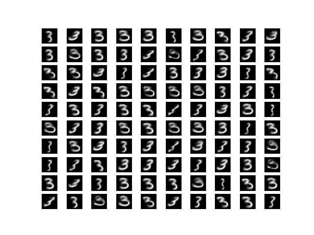
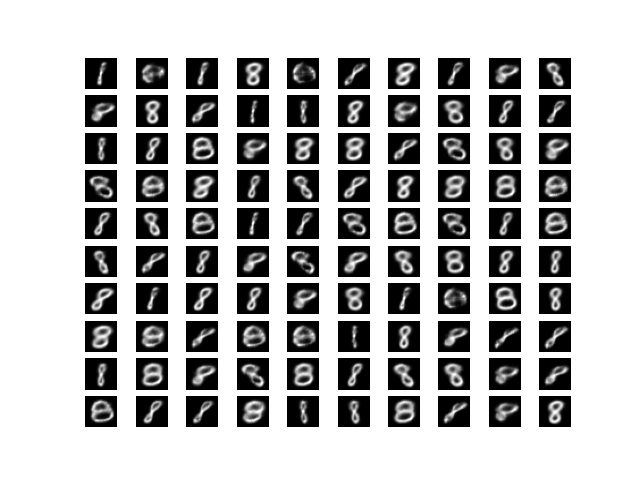

## Generative AI
### Getting started

##### Create a virtual environment
`python -m venv .venv`
##### Activate the venv
`PowerShell -ExecutionPolicy Bypass`  
`.venv/Scripts/activate`  
##### Install dependencies
`pip install -r requirements.txt`

### To train a new model
There are four models available: a diffusion model, a vae, a cvae, and a gan. To train one of these models, use the code below. Provide the name of the model file that will be saved and the model type. Models will be saved in the Models folder  
`python3.10 trainnewmodel.py diffusiontest.keras diffusion`  
`python3.10 trainnewmodel.py vaetest.keras vae`  
`python3.10 trainnewmodel.py cvaetest.keras cvae`  
`python3.10 trainnewmodel.py gantest.keras gan`  

### To generate images using a saved model
To generate images using one of the trained models, use the code below:  
`python3.10 generatenewimages.py Models/<ModelName> diffusion`  
`python3.10 generatenewimages.py Models/<ModelName> VAE`  
`python3.10 generatenewimages.py Models/<ModelName> cvae`  

### Example outputs

| Model      | Image |
| ----------- | ----------- |
| MNIST images from VAE Model |  |
| MNIST images from Diffusion Model |  |
| CVAE Model Number 3 |  |
| CVAE Model Number 4 |  |
| CVAE Model Number 8 |  |
